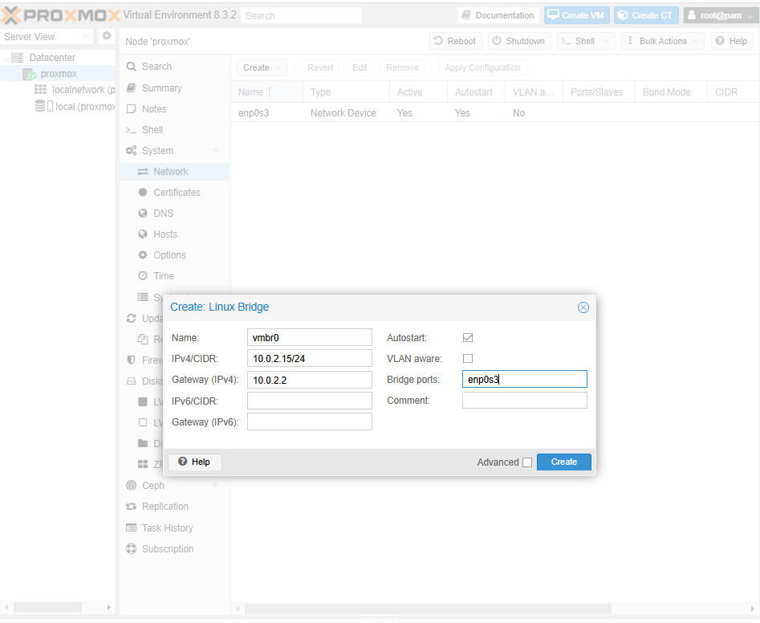
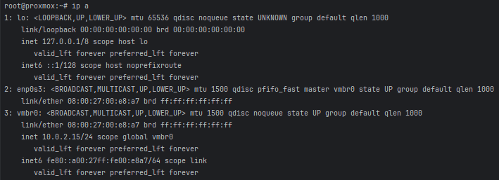
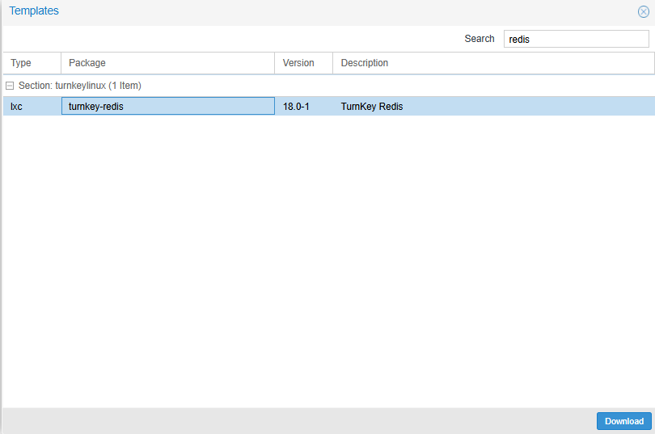
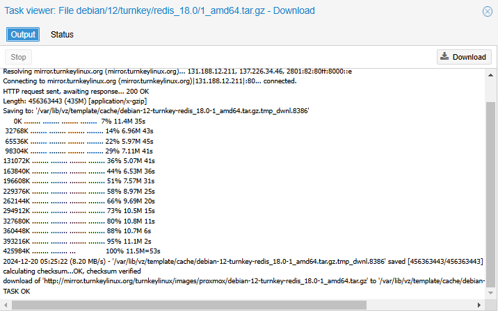
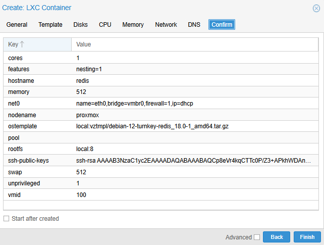
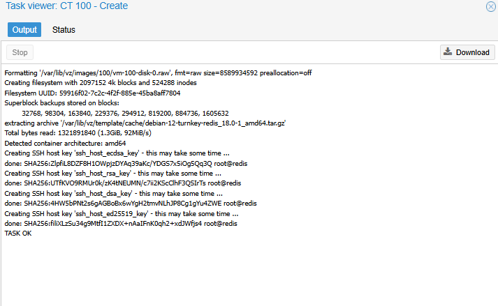
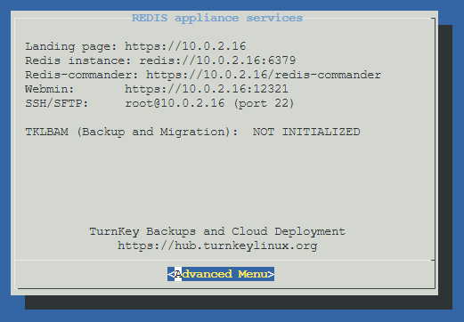
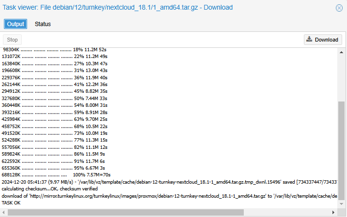
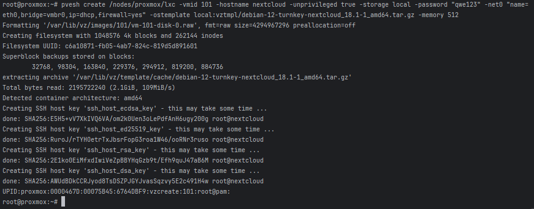
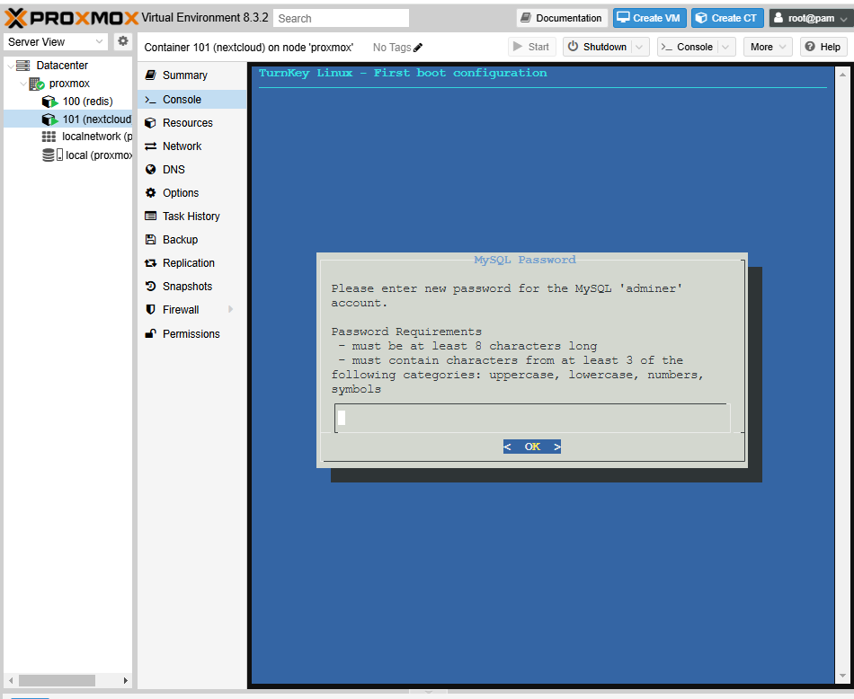
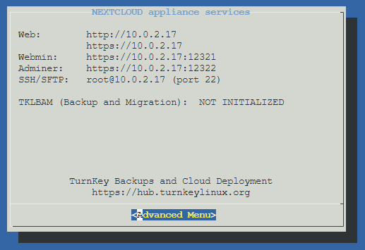
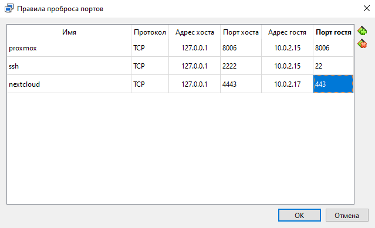
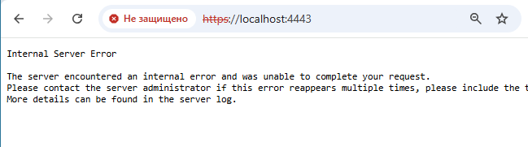
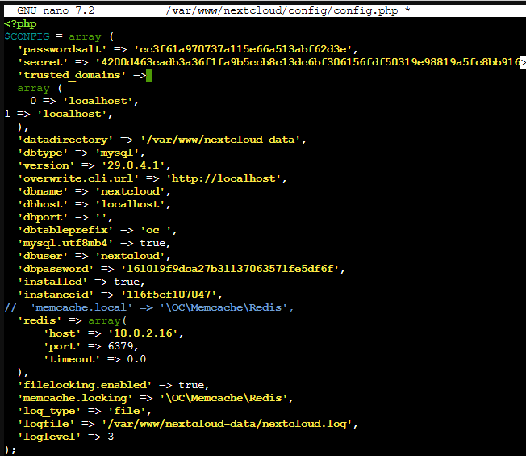
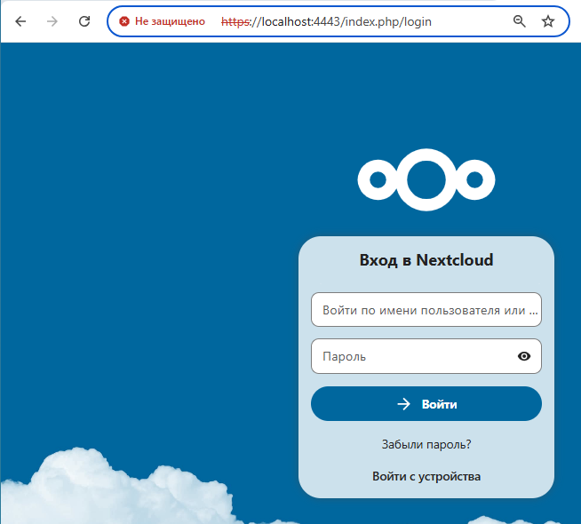

-	Почему неправильная конфигурация на шаге 2 приведет (вероятнее всего) к полной потере сетевой доступности?

После добавления bridge пакеты будут идти через него, при ошибке конфига он может не подняться или смотреть не туда

- Почему адрес шлюза (default gateway) виртуальной машины выглядит как 10.0.2.2, а не 10.0.2.1?

VB использует 10.0.2.1 для своих нужд
